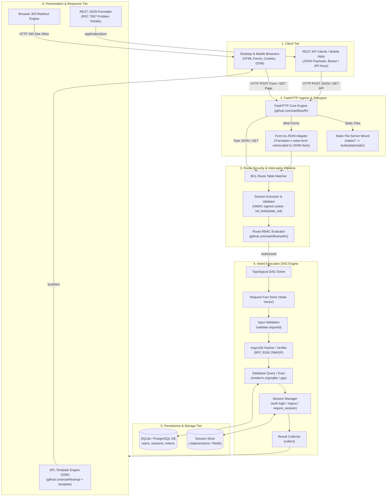
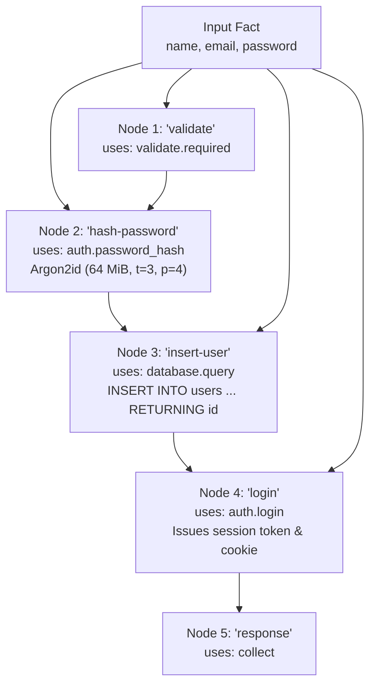
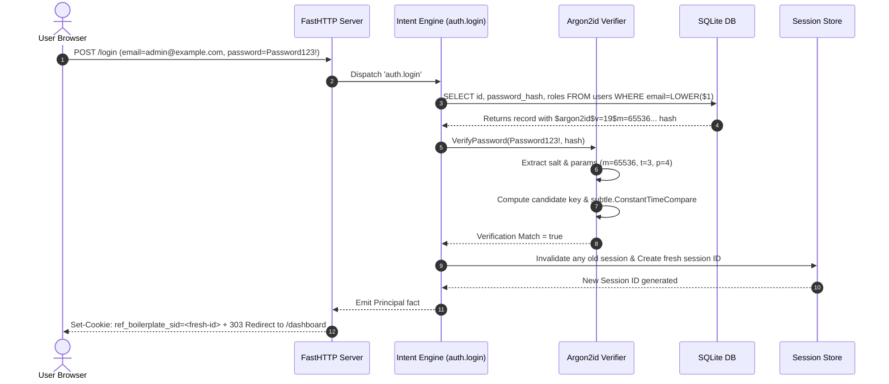
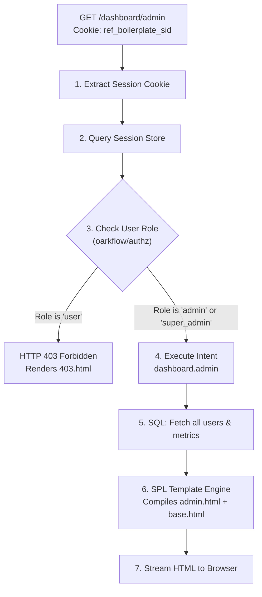

# REF Enterprise Architecture, Workflow & Execution Pipeline Guide

This guide provides a comprehensive, end-to-end breakdown of how the **REF Platform**, **FastHTTP (`fh`)**, **Argon2id (RFC 9106)**, **Enterprise RBAC (`github.com/oarkflow/authz`)**, and the **SPL Template Engine (`github.com/oarkflow/spl` & `github.com/oarkflow/template`)** are wired together, how requests traverse the system, and how the Directed Acyclic Graph (DAG) fact engine processes workloads.

---

## 📑 Table of Contents

1. [High-Level Architectural Blueprint](#1-high-level-architectural-blueprint)
2. [Component Interconnection Matrix (How Everything Connects)](#2-component-interconnection-matrix-how-everything-connects)
3. [The Request Processing Pipeline](#3-the-request-processing-pipeline)
   - [Phase 1: Ingress & Protocol Translation](#phase-1-ingress--protocol-translation)
   - [Phase 2: Authentication & Route-Level RBAC Guard](#phase-2-authentication--route-level-rbac-guard)
   - [Phase 3: DAG Engine Compilation & Fact Resolution](#phase-3-dag-engine-compilation--fact-resolution)
   - [Phase 4: Node Action Execution (Argon2id, SQL, Sessions)](#phase-4-node-action-execution-argon2id-sql-sessions)
   - [Phase 5: Response Serialization & SSR Template Rendering](#phase-5-response-serialization--ssr-template-rendering)
4. [Step-by-Step Concrete Walkthrough Examples](#4-step-by-step-concrete-walkthrough-examples)
   - [Example 1: End-to-End User Registration & Argon2id Hashing](#example-1-end-to-end-user-registration--argon2id-hashing)
   - [Example 2: Credential Verification & Session Fixation Protection](#example-2-credential-verification--session-fixation-protection)
   - [Example 3: Protected Admin Portal & Role Hierarchy Enforcement](#example-3-protected-admin-portal--role-hierarchy-enforcement)
   - [Example 4: Admin Role Mutation Workflow (`POST /dashboard/admin/role`)](#example-4-admin-role-mutation-workflow)
   - [Example 5: Dual Protocol Web & REST API Execution](#example-5-dual-protocol-web--rest-api-execution)
5. [SPL Template Engine & SecureMode Architecture](#5-spl-template-engine--securemode-architecture)
6. [Declarative BCL Compilation Mechanics](#6-declarative-bcl-compilation-mechanics)
7. [Observability, Debugging & Inspection](#7-observability-debugging--inspection)

---

## 1. High-Level Architectural Blueprint

The application is structured into six clean, decoupled architectural layers. No business logic or route registrations reside in Go code; everything is declared in Business Configuration Language (BCL) specifications and compiled into an optimized execution graph.



---

## 2. Component Interconnection Matrix (How Everything Connects)

The table below explains how files, packages, and declarative specifications map directly to one another:

| Layer / File | Defines | Consumed By / Connected To | Purpose |
| :--- | :--- | :--- | :--- |
| **`cmd/server/main.go`** | Entry Point | `platform.LoadDir`, `web.NewSPLRenderer`, `app.Mount` | Pure bootstrapper; zero Go routes; loads BCL files and starts server. |
| **`bcl/01_app.bcl`** | Application Metadata | `platform.Compile` | Defines app name, version (`v1.0.0`), and environment defaults. |
| **`bcl/02_roles.bcl`** | RBAC Role Hierarchy | `platform.compileRoles`, `oarkflow/authz` | Defines roles (`super_admin > admin > manager > user > guest`) and permissions. |
| **`bcl/03_resources.bcl`** | Infrastructure Specs | `platform.Resources` | Declares database (`sqlite`), file session store, session auth, and RBAC authorizer. |
| **`bcl/04_intents_auth.bcl`** | Auth DAG Workflows | `platform.compileIntents` | Declares `auth.register`, `auth.login`, `auth.logout`, `auth.forgot_password`, etc. |
| **`bcl/05_intents_dashboard.bcl`** | Dashboard DAGs | `platform.compileIntents` | Declares `dashboard.index`, `dashboard.admin`, `dashboard.admin_update_role`, etc. |
| **`bcl/06_routes_web.bcl`** | Web Route Handlers | `platform.Mount(fh.App)` | Maps web URLs (`/login`, `/register`, `/dashboard`, etc.) to templates and intents. |
| **`bcl/07_routes_api.bcl`** | REST API Endpoints | `platform.Mount(fh.App)` | Exposes JSON endpoints under `/api/v1/auth/*`. |
| **`bcl/08_static.bcl`** | Static Asset Serving | `platform.compileStatic` | Mounts directory `static/` to URL prefix `/static` with caching headers. |
| **`platform/argon2id.go`** | Argon2id Hasher | `actions_auth.go` (`auth.password_hash`, `auth.login`) | RFC 9106 cryptographic implementation with constant-time dummy verify. |
| **`platform/routes.go`** | FastHTTP Adapter | `p.Mount(app)` | Translates HTTP requests, handles session cookies, executes DAGs, and triggers SSR. |
| **`internal/web/renderer.go`** | SPL Template Adapter | `fh.WithTemplateEngine` | Implements `fh.TemplateEngine` for SPL and loads layouts/components. |
| **`internal/rbac/rbac.go`** | Enterprise RBAC | `oarkflow/authz` | Provides hierarchical role checks, wildcard permission matching (`users:*`). |
| **`internal/telemetry/logger.go`** | Structured Logger & Audit | `cmd/server/main.go`, `internal/security` | Zero-allocation JSON/console structured logging & compliance audits via `github.com/oarkflow/zlog`. |
| **`internal/security/guard.go`** | Anomaly Detection Guard | `cmd/server/main.go` | Real-time anomaly detection, brute force limits & business rule guards via `github.com/oarkflow/tcpguard`. |
| **`templates/layouts/*.html`** | Base HTML Shells | `templates/pages/**/*.html` | Master layout providing navbar, alerts, footer, and styling links. |
| **`static/css/app.css`** | Glassmorphic Styling | Loaded by `layouts/base.html` | Modern responsive dark mode design system. |
| **`static/js/app.js`** | Client Script | Loaded by `layouts/base.html` | Password strength meter, interactive role dropdowns, copy tokens. |

---

## 3. The Request Processing Pipeline

When any HTTP request reaches the server, it passes through five deterministic execution phases:

```
[HTTP Request Ingress]
        │
        ▼
[Phase 1: Ingress & Protocol Translation]
   ├── Parses headers & cookies
   └── If 'x-www-form-urlencoded', converts form body into JSON fact map
        │
        ▼
[Phase 2: Authentication & Route-Level RBAC Guard]
   ├── Inspects cookie: 'ref_boilerplate_sid'
   ├── Resolves Principal (ID, Roles, Permissions)
   └── Validates route rules via 'oarkflow/authz' (Returns 401/403 if unauthorized)
        │
        ▼
[Phase 3: DAG Engine Compilation & Fact Resolution]
   ├── Reads Intent BCL specification
   ├── Performs topological sort of DAG nodes
   └── Injects initial fact vector: 'input', 'user_id', 'principal'
        │
        ▼
[Phase 4: Node Action Execution]
   ├── 1. Validation ('validate.required')
   ├── 2. Cryptography (Argon2id 'auth.password_hash' or 'auth.login')
   ├── 3. Database ('database.query' / 'database.exec')
   ├── 4. Session Mutation ('auth.login' issues cookie, 'auth.logout' destroys)
   └── 5. Result Collection ('collect' aggregates final fact payload)
        │
        ▼
[Phase 5: Response Serialization & SSR Template Rendering]
   ├── If Web Action: Issues HTTP 303 Redirect to destination URL
   ├── If Web View: SPL Engine compiles template AST, evaluates blocks, emits HTML
   └── If REST API: Serializes fact payload to JSON (application/json)
```

### Phase 1: Ingress & Protocol Translation
Web browsers submit HTML form payloads with `Content-Type: application/x-www-form-urlencoded`. The REF FastHTTP adapter inspects incoming requests in `platform/routes.go`:
- If `application/x-www-form-urlencoded`, form values are extracted and converted into a canonical JSON byte slice.
- For example, `name=Alice&email=alice%40example.com` becomes `{"name":"Alice","email":"alice@example.com"}`.
- This allows BCL intent nodes to consume `input.name` and `input.email` uniformly regardless of whether the caller is a web browser or an API client.

### Phase 2: Authentication & Route-Level RBAC Guard
Before executing the intent, the route's security interceptor executes:
1. **Cookie Verification**: The `ref_boilerplate_sid` cookie is extracted and verified against the session store.
2. **Principal Extraction**: The caller's `user_id` and assigned `roles` (`user`, `manager`, `admin`, etc.) are placed into the request context.
3. **RBAC Evaluation**: If the route specifies an `authz` block (e.g. `roles ["admin", "super_admin"]`), the RBAC engine (`github.com/oarkflow/authz`) validates whether the user's role hierarchy grants access:
   - If not authenticated: returns `HTTP 401 Unauthorized`.
   - If authenticated but lacking required role: returns `HTTP 403 Forbidden` (renders `templates/pages/errors/403.html`).

### Phase 3: DAG Engine Compilation & Fact Resolution
Intents in REF are Directed Acyclic Graphs. Unlike traditional procedural controllers where functions are called sequentially in Go:
- Each node specifies what facts it **requires** and what facts it **provides**.
- The engine computes the topological dependency order.
- Nodes that do not depend on each other can execute concurrently.
- If an input validation node fails, downstream database and crypto nodes are automatically skipped.

### Phase 4: Node Action Execution (Argon2id, SQL, Sessions)
Built-in platform actions execute within the node graph:
- `auth.password_hash`: Generates cryptographically secure 16-byte random salt, invokes Argon2id with OWASP parameters (64 MiB RAM, 3 iterations, 4 threads), and outputs a PHC-formatted hash.
- `auth.login`: Verifies passwords against Argon2id or legacy Bcrypt hashes using constant-time comparison, regenerates session IDs to defeat session fixation attacks, and writes the session to disk.
- `database.query` / `database.exec`: Executes parameterized SQL statements against SQLite/PostgreSQL, protecting against SQL injection.
- `collect`: Gathers computed facts into the final response payload.

### Phase 5: Response Serialization & SSR Template Rendering
The platform selects the appropriate response strategy based on route metadata:
- **Web Form Actions**: Responds with `HTTP 303 See Other` and sets the `Location` header to redirect the user to the destination view (e.g., `/dashboard`), preserving clean URL history.
- **Web View Routes**: Hands the collected fact payload to the SPL Template Engine (`internal/web/renderer.go`). The engine resolves the template, executes template inheritance (`@extends`), interpolates variables, and streams secure HTML to the browser.
- **REST API Routes**: Emits formatted JSON with `Content-Type: application/json`.

---

## 4. Step-by-Step Concrete Walkthrough Examples

---

### Example 1: End-to-End User Registration & Argon2id Hashing

Let us trace what happens when a new user registers on the website:

```
[Browser: Fill Form] ──(POST /register)──> [FastHTTP Adapter] ──> [auth.register DAG] ──> [Set-Cookie + 303 Redirect] ──> [GET /dashboard]
```

#### Step 1.1: Browser Form Submission
The user enters their details on `http://localhost:8080/register` and clicks "Create Account":
```http
POST /register HTTP/1.1
Host: localhost:8080
Content-Type: application/x-www-form-urlencoded

name=Carol+Danvers&email=carol%40example.com&password=SuperSecretPassword123!
```

#### Step 1.2: BCL Route Matching & Protocol Conversion
The FastHTTP server matches route `web.register_action` declared in `bcl/06_routes_web.bcl`:
```bcl
route "web.register_action" {
  method POST
  path "/register"
  intent "auth.register"
  session "sessions"
  status 201
  allow_anonymous true
}
```
The server translates the form fields into an initial input fact:
```json
{
  "name": "Carol Danvers",
  "email": "carol@example.com",
  "password": "SuperSecretPassword123!"
}
```

#### Step 1.3: Intent DAG Execution (`auth.register`)
The intent engine runs the DAG defined in `bcl/04_intents_auth.bcl`:



1. **Node `validate`**: Verifies that `input.email`, `input.name`, and `input.password` are non-empty. Emits fact `validated = true`.
2. **Node `hash-password`**: Invokes `platform/argon2id.go`:
   - Enforces minimum password length (8 characters).
   - Generates 16 bytes of cryptographically random salt from `crypto/rand`.
   - Derives key using `argon2.IDKey([]byte(password), salt, 3, 65536, 4, 32)`.
   - Formats PHC string:
     ```
     $argon2id$v=19$m=65536,t=3,p=4$kF9...$Z8x...
     ```
   - Emits fact `password_hash`.
3. **Node `insert-user`**: Executes parameterized SQL against SQLite:
   ```sql
   INSERT INTO users (id, email, name, password_hash, roles, status)
   VALUES (LOWER($1), LOWER($1), $2, $3, 'user', 'active')
   RETURNING id, email, name, password_hash, roles, status, created_at;
   ```
   Emits fact `users` containing Carol's new database record with role `user`.
4. **Node `login`**: Calls `auth.login`:
   - Creates a new session record in the session manager.
   - Binds `principal` with user ID, email, and roles.
   - Emits fact `principal`.
5. **Node `response`**: Collects the payload.

#### Step 1.4: Cookie Issuance & Browser Redirection
The server attaches the session cookie and redirects the browser:
```http
HTTP/1.1 303 See Other
Location: /dashboard
Set-Cookie: ref_boilerplate_sid=v1.9a8f...; Path=/; Max-Age=86400; HttpOnly; SameSite=Lax
Content-Type: text/html; charset=utf-8
```
The browser receives the cookie and immediately navigates to `GET /dashboard`.

---

### Example 2: Credential Verification & Session Fixation Protection

When an existing user logs in:



#### Timing Attack Defense:
If an attacker attempts to log in with an email address that does **not** exist in the database (e.g. `ghost@example.com`):
- `platform/actions_auth.go` intercepts the empty database result.
- Instead of returning early, it executes `VerifyPassword` against a static dummy Argon2id hash.
- The dummy check consumes identical CPU cycles and memory (64 MiB, ~45ms) as a valid account check.
- The attacker cannot use timing latency measurements to enumerate registered email addresses.

#### Session Fixation Defense:
When `auth.login` succeeds, any existing unauthenticated or pre-existing session ID is explicitly regenerated. The user is issued a completely new cryptographically random session token.

---

### Example 3: Protected Admin Portal & Role Hierarchy Enforcement

Let us trace what occurs when a user visits `http://localhost:8080/dashboard/admin`:



#### Step 3.1: Route RBAC Configuration in `06_routes_web.bcl`
```bcl
route "web.admin" {
  method GET
  path "/dashboard/admin"
  intent "dashboard.admin"
  template "pages/dashboard/admin"
  layout "layouts/base"
  session "sessions"
  auth "session_auth"
  authz {
    roles ["admin", "super_admin"]
    authorizer "authorization"
  }
}
```

#### Step 3.2: Role Inheritance Tree in `02_roles.bcl`
The RBAC engine (`github.com/oarkflow/authz`) models role inheritance:
```
super_admin ──(inherits)──> admin ──(inherits)──> manager ──(inherits)──> user ──(inherits)──> guest
```
- If `Bob` is logged in as `user`: Access is **denied** (HTTP 403 Forbidden).
- If `Alice` is logged in as `admin`: Access is **granted** because `admin` is explicitly in `roles ["admin", "super_admin"]`.
- If `Root` is logged in as `super_admin`: Access is **granted** because `super_admin` inherits all permissions and satisfies the role check.

#### Step 3.3: Intent Execution (`dashboard.admin` in `05_intents_dashboard.bcl`)
1. **Node `user-id`**: Extracts the authenticated caller's user ID from the session.
2. **Node `load-admin`**: Queries `SELECT id, email, name, roles FROM users WHERE id = $1` to retrieve the admin's identity.
3. **Node `load-all-users`**: Executes:
   ```sql
   SELECT id, email, name, roles, status, created_at FROM users ORDER BY created_at DESC LIMIT 50;
   ```
4. **Node `response`**: Packages `{ user: {...}, users: [...] }`.

#### Step 3.4: Server-Side Rendering with SPL
The SPL Template Engine compiles `templates/pages/dashboard/admin.html` wrapped inside `templates/layouts/base.html`:
- The `@for(u in users)` loop generates the user management table.
- Badges for `admin`, `manager`, and `user` are dynamically color-coded.
- The interactive role change form is bound to each user row.

---

### Example 4: Admin Role Mutation Workflow

When an administrator changes a user's role in the admin console:

```
[Admin selects 'manager' for user@example.com]
        │
        ▼ (POST /dashboard/admin/role)
[Route Guard: Validates admin/super_admin role via authz]
        │
        ▼
[Intent: dashboard.admin_update_role]
   ├── Node 'validate': Checks input.user_id and input.role
   └── Node 'update-role': Runs SQL UPDATE users SET roles = $1 WHERE id = $2
        │
        ▼
[FastHTTP Adapter: Issues HTTP 303 See Other -> Location: /dashboard/admin]
        │
        ▼
[Browser reloads /dashboard/admin displaying updated role badge]
```

#### The BCL Intent Definition (`05_intents_dashboard.bcl`):
```bcl
intent "dashboard.admin_update_role" {
  description "Update a user's role from admin portal"
  response "response"

  node "user-id" {
    uses "auth.require_session"
    resource "sessions"
    kind decision
    provides [admin_id]
  }

  node "validate" {
    uses "validate.required"
    requires [input]
    provides [validated]
    config { fields [input.user_id, input.role] }
  }

  node "update-role" {
    uses "database.exec"
    resource "database"
    kind effect
    requires [admin_id, input, validated]
    provides [role_updated]
    config {
      statement "UPDATE users SET roles = $1, updated_at = CURRENT_TIMESTAMP WHERE id = $2"
      args [input.role, input.user_id]
      require_affected true
      not_found_message "user not found"
    }
  }

  node "response" {
    uses "collect"
    requires [role_updated]
    provides [response]
  }
}
```
The node uses `kind effect` and `require_affected true`. If an invalid `user_id` is supplied, the database node fails safely with `not_found_message: "user not found"`.

---

### Example 5: Dual Protocol Web & REST API Execution

The same business logic is reusable by both browser web views and REST API clients without code duplication:

| Protocol | Route | Request Payload | Response Format |
| :--- | :--- | :--- | :--- |
| **Web Browser** | `POST /login` | `application/x-www-form-urlencoded` | `HTTP 303 See Other` + `Set-Cookie` header |
| **REST API** | `POST /api/v1/auth/login` | `application/json` | `HTTP 200 OK` + `{"status":"ok","principal":{...}}` |

#### REST API Request Example:
```bash
curl -X POST http://localhost:8080/api/v1/auth/login \
  -H "Content-Type: application/json" \
  -d '{"email":"admin@example.com","password":"Password123!"}'
```

#### REST API Response:
```json
{
  "principal": {
    "id": "admin@example.com",
    "roles": ["admin"],
    "claims": {
      "email": "admin@example.com",
      "name": "Alice Admin",
      "status": "active"
    }
  }
}
```

---

## 5. SPL Template Engine & SecureMode Architecture

The web presentation tier is powered by `github.com/oarkflow/spl` and `github.com/oarkflow/template`.

### Template Hierarchy & Layout Inheritance

```
templates/layouts/base.html (Master shell: CSS links, glass navbar, notifications container, footer)
    ▲
    │ (@extends)
    │
    ├── templates/pages/dashboard/index.html   (User overview & role-specific metrics)
    ├── templates/pages/dashboard/admin.html   (Governance table, role switcher, system health)
    ├── templates/pages/dashboard/manager.html (Operations, audit metrics, compliance)
    └── templates/pages/dashboard/profile.html (Account details, password updater)
```

### SPL SecureMode Constraints
The SPL engine runs with `SecureMode = true` to protect against Cross-Site Scripting (XSS):
1. **Zero Inline `<script>` Tags**: Template files cannot contain `<script>` tags or inline event attributes (`onclick`, `onload`, `onkeyup`).
2. **External Script Isolation**: Client-side logic is strictly quarantined to external static assets (`/static/js/app.js`), served with strict `Content-Security-Policy` headers.
3. **Variable Fallback Safety**: Identifiers accessed in templates via `${var}` must exist in the render data map or `SPLEngine.Globals`. `internal/web/renderer.go` pre-registers comprehensive default fallbacks for `title`, `appName`, `user`, `users`, `roles`, and `reports`.

---

## 6. Declarative BCL Compilation Mechanics

When the server starts in `cmd/server/main.go`, `platform.LoadDir` reads the files in numerical order:

```
01_app.bcl        ──> Identifies application name & version
02_roles.bcl      ──> Compiles role hierarchy & initializes oarkflow/authz
03_resources.bcl  ──> Opens SQLite database & initialises session pool
04_intents_auth.bcl ──> Compiles auth DAG graphs (register, login, reset)
05_intents_dashboard.bcl ──> Compiles dashboard DAG graphs (index, admin, manager)
06_routes_web.bcl ──> Maps HTTP paths to SPL templates and intents
07_routes_api.bcl ──> Maps /api/v1 routes to intents
08_static.bcl     ──> Configures static file serving from disk
```

1. **Schema Validation**: The BCL compiler checks that every `intent` referenced in a `route` actually exists, and that every `resource` referenced in a node is defined.
2. **Mounting**: `p.Mount(app)` registers all routes, middlewares, and static file handlers onto the `github.com/oarkflow/fh` HTTP router.
3. **Zero Boilerplate in Go**: New routes, pages, permissions, and database operations can be added simply by authoring `.bcl` and `.html` files without recompiling Go binaries.

---

## 7. Observability, Debugging & Inspection

### Visualizing DAG Execution
To inspect fact flow and node execution timing during development:
1. Run the server with verbose logging:
   ```bash
   APP_ENV=development PORT=8080 go run ./boilerplate/cmd/server
   ```
2. Each request logs:
   - Route match pattern and HTTP method.
   - Session extraction and principal role resolution.
   - Node-by-node execution time in milliseconds.
   - Total render and response latency.

### Testing the Full Pipeline Programmatically
The test suite in `boilerplate/boilerplate_test.go` verifies all pipeline stages automatically:
```bash
go test -v ./boilerplate/...
```
- `TestArgon2idSecurity`: Confirms RFC 9106 compliance and timing attack resistance.
- `TestAuthRegister` & `TestAuthLogin`: Tests end-to-end DAG execution.
- `TestRBACRoleHierarchyAndPermissions`: Verifies multi-tier role inheritance.
- `TestSPLTemplateRendering`: Validates template compilation and layout inheritance.
- `TestBCLLoadDirAndMount`: Verifies pure BCL loading and FastHTTP route mounting.
